## Cash Book

# By Rohan Rusho

## Table of Contents

- [Overview](#overview)
- [Features](#features)
- [Screenshots](#screenshots)
- [Getting Started](#getting-started)
- [Installation](#installation)
- [Usage](#usage)
- [Configuration](#configuration)
- [Contributing](#contributing)
- [Roadmap](#roadmap)
- [License](#license)
- [Contact](#contact)

---

## Overview

**A** is a robust, user-friendly application built to [briefly describe your app’s purpose, e.g., manage tasks, track finances, etc.].  
It delivers a seamless experience for [your target audience] with a focus on performance, reliability, and simplicity.

---

## Features

- **User Authentication:** Secure login and registration.
- **Dashboard:** Intuitive overview with quick actions.
- **Profile Management:** Update profile and personal data.
- **Advanced Search:** Find information with powerful filters.
- **Reports & Analytics:** Detailed statistics and visualizations.
- **Notifications:** Real-time alerts.
- **Settings:** Personalize your experience.
- **Responsive Design:** Works on all device sizes.
- **Data Export/Import:** Easy data transfer.
- **Multi-language Support:** Use in multiple languages.
- **Dark Mode:** Eye-friendly theme option.
- **Help & Support:** Built-in help center.

---

## Screenshots

Below are feature highlights from the app. All screenshots are available in the [`SS/`](SS) folder.

<table>
  <tr>
    <td><br/><b>Main</b></td>
    <td>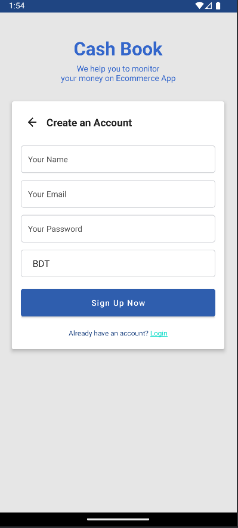<br/><b>Login</b></td>
    <td>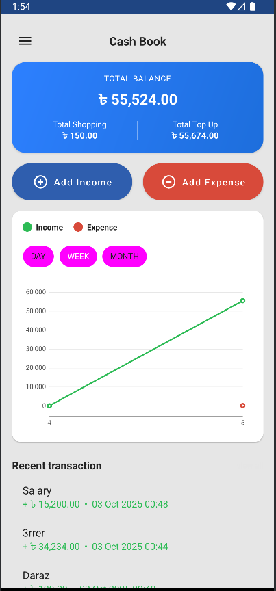<br/><b>Dashboard</b></td>
    <td>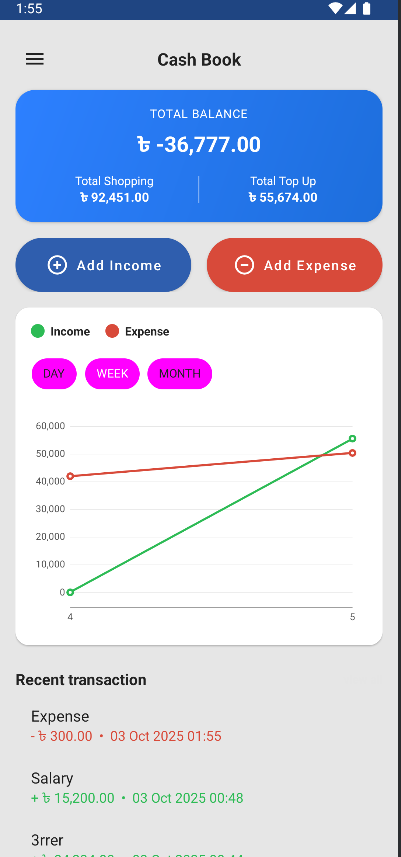<br/><b>Profile</b></td>
  </tr>
  <tr>
    <td>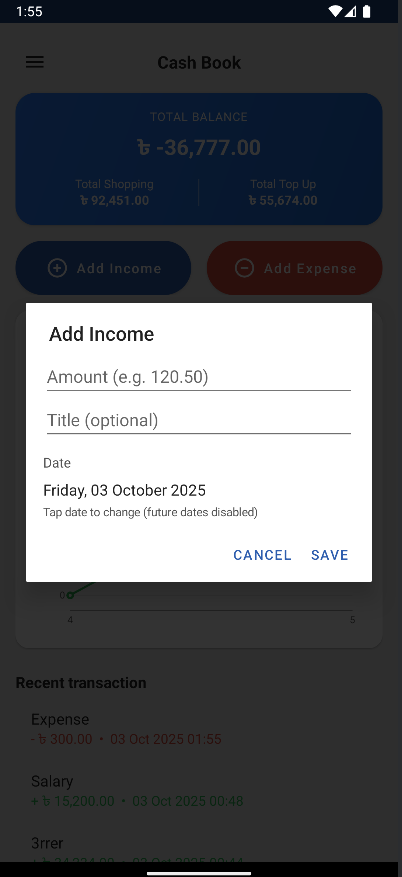<br/><b>Search</b></td>
    <td>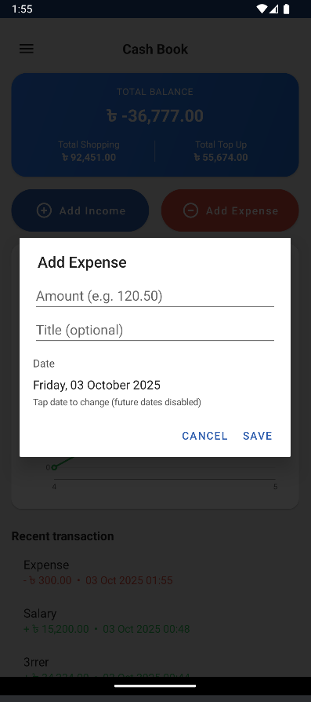<br/><b>Reports</b></td>
    <td>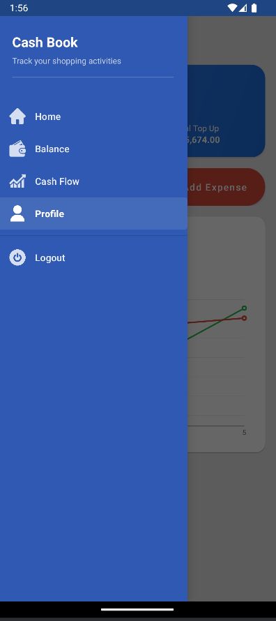<br/><b>Notifications</b></td>
    <td>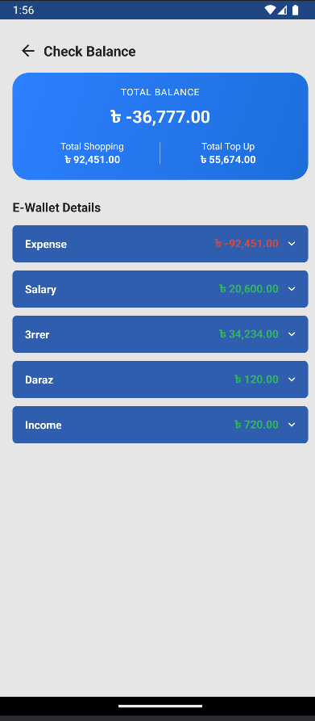<br/><b>Settings</b></td>
  </tr>
  <tr>
    <td>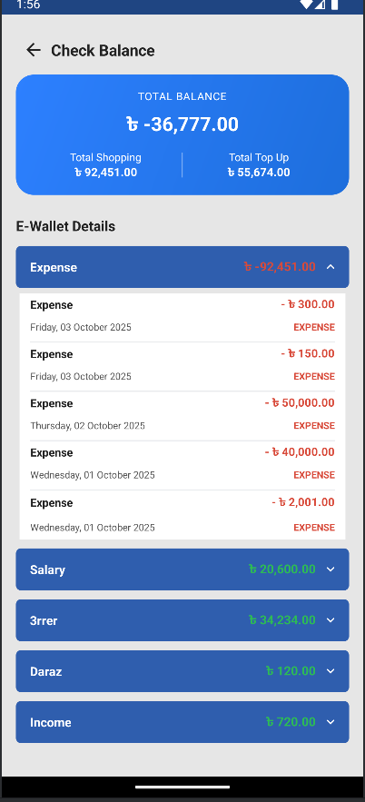<br/><b>Mobile</b></td>
    <td>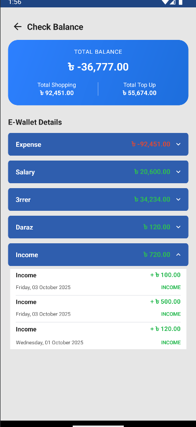<br/><b>Export/Import</b></td>
    <td>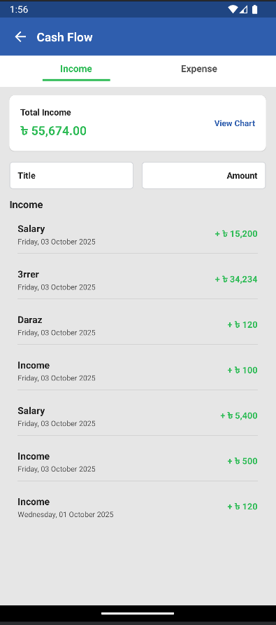<br/><b>Languages</b></td>
    <td>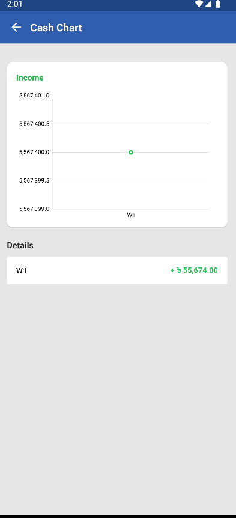<br/><b>Dark Mode</b></td>
  </tr>
  <tr>
    <td>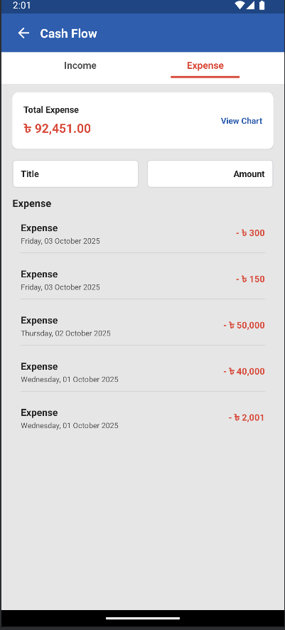<br/><b>Help</b></td>
    <td>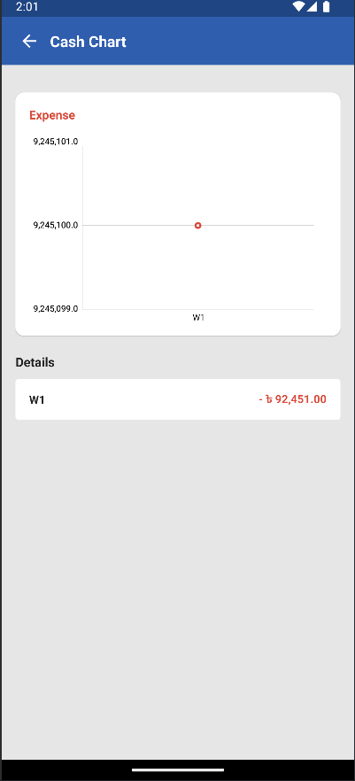<br/><b>Feature 14</b></td>
    <td>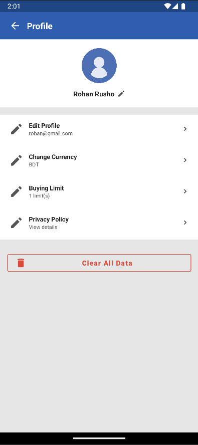<br/><b>Feature 15</b></td>
    <td>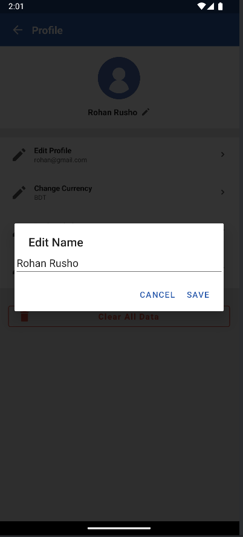<br/><b>Feature 16</b></td>
  </tr>
  <tr>
    <td>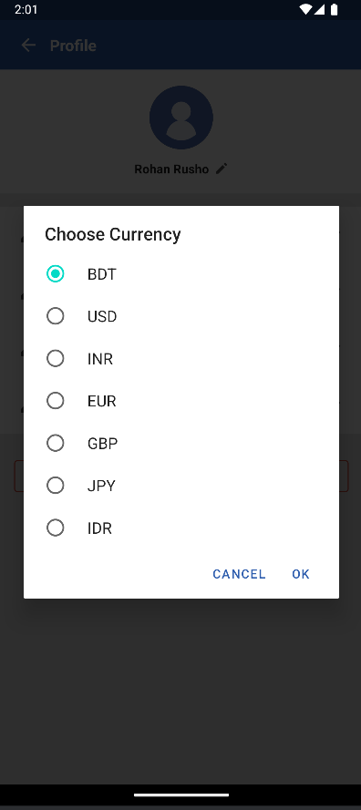<br/><b>Feature 17</b></td>
    <td>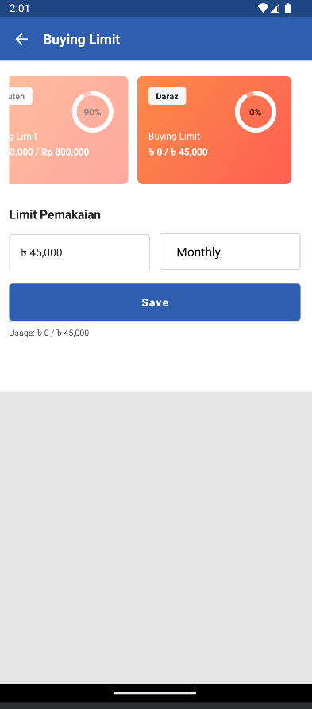<br/><b>Feature 18</b></td>
    <td>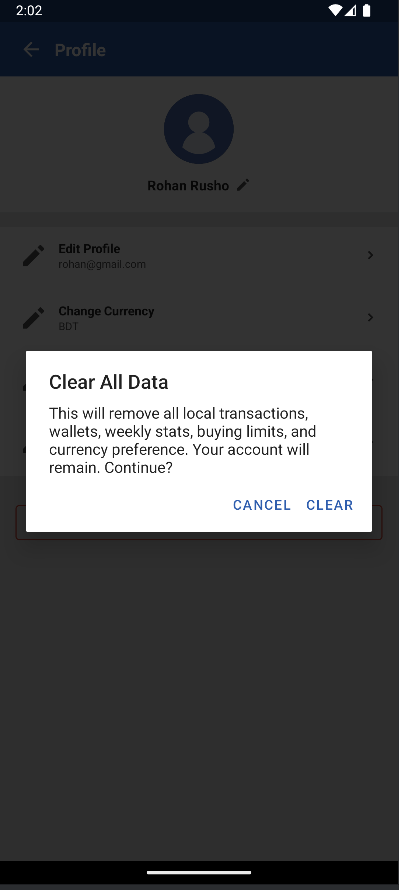<br/><b>Feature 19</b></td>
    <td>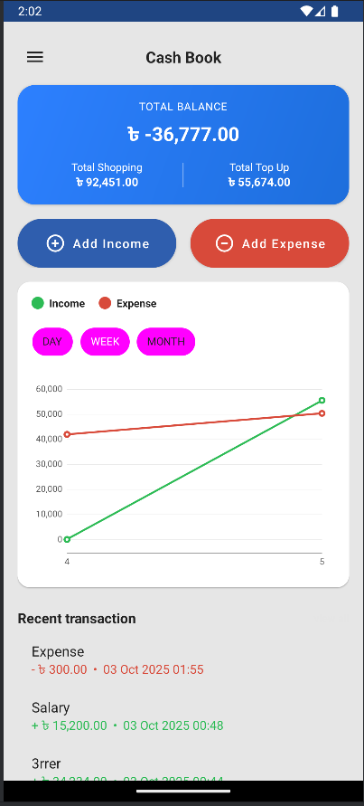<br/><b>Feature 20</b></td>
  </tr>
</table>

---

## Getting Started

### Prerequisites

- [List all required software, e.g. Node.js, Python, Java, Android Studio, etc.]
- [Any required dependencies, e.g. npm, pip, gradle, etc.]

### Installation

1. **Clone the repo:**
   ```bash
   git clone https://github.com/your-username/A.git
   cd A
   ```

2. **Install dependencies:**
   ```bash
   # Node.js example
   npm install

   # Python example
   pip install -r requirements.txt

   # Android example
   ./gradlew build
   ```

3. **Configure environment:**
   - Copy `.env.example` to `.env` and fill in any required variables.

---

## Usage

1. **Start the application:**
   ```bash
   # Node.js
   npm start

   # Python
   python main.py

   # Android
   # Open in Android Studio and run
   ```

2. **Log in or register.**
3. **Explore features as shown in the screenshots above.**

---

## Configuration

- **Environment Variables:**  
  Edit `.env` or `config.json` for API keys and settings.

- **Customization:**  
  See the `docs/` folder for advanced configuration options.

---

## Contributing

We welcome contributions!  
Please see [CONTRIBUTING.md](CONTRIBUTING.md) for guidelines.

1. Fork the repo
2. Create your feature branch (`git checkout -b feature/AmazingFeature`)
3. Commit your changes (`git commit -am 'Add some feature'`)
4. Push to the branch (`git push origin feature/AmazingFeature`)
5. Open a Pull Request

---

## Roadmap

- [ ] Add more integrations
- [ ] Improve accessibility
- [ ] Support additional export formats
- [ ] [Your next features here]

---

## License

Distributed under the MIT License. See [LICENSE](LICENSE) for details.

---

## Contact

Created by [Your Name](https://github.com/your-username)  
For questions or support, email [your-email@example.com](mailto:your-email@example.com)

---

## Acknowledgements

- [Awesome Library 1](https://github.com/...)
- [Awesome Library 2](https://github.com/...)
- Your team and community contributors
