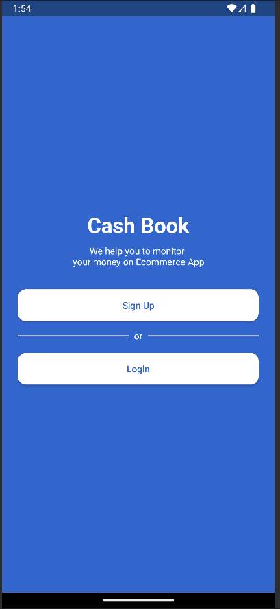

# A

 <!-- Replace with your logo or main screenshot if you like -->

## Table of Contents

- [Overview](#overview)
- [Features](#features)
- [Screenshots](#screenshots)
- [Getting Started](#getting-started)
- [Installation](#installation)
- [Usage](#usage)
- [Configuration](#configuration)
- [Contributing](#contributing)
- [Roadmap](#roadmap)
- [License](#license)
- [Contact](#contact)

---

## Overview

**A** is a modern, robust, and user-friendly application designed to [briefly describe your app’s core purpose].  
It provides a seamless experience for [your target audience] with a focus on simplicity, performance, and reliability.

---

## Features

- **User Authentication:** Secure login and registration system.  
  

- **Dashboard:** Intuitive dashboard displaying key information and quick actions.  
  

- **Profile Management:** Update user profile, change password, and manage personal data.  
  

- **Advanced Search:** Quickly find relevant data using filters and search criteria.  
  

- **Reports & Analytics:** View statistics and generate insightful reports.  
  

- **Notifications:** Real-time alerts and notification system.  
  

- **Settings:** Customize app preferences and configurations.  
  

- **Responsive Design:** Fully functional on desktop, tablet, and mobile devices.  
  

- **Data Export/Import:** Easily export or import data in various formats.  
  

- **Multi-language Support:** Supports English and other languages.  
  

- **Dark Mode:** Switch between light and dark themes.  
  

- **Help & Support:** Integrated help center and contact support.  
  

*(And more! See below for additional screenshots and details.)*

---

## Screenshots

| Feature                   | Screenshot                |
|---------------------------|---------------------------|
| Login                     |         |
| Dashboard                 |     |
| Profile                   |       |
| Search                    |        |
| Reports                   |       |
| Notifications             | |
| Settings                  |      |
| Mobile View               |        |
| Export/Import             |       |
| Language Settings         |         |
| Dark Mode                 |         |
| Help Center               |         |
| ...                       |         |

*See the [SS](SS) folder for all screenshots (1.png to 20.png).*

---

## Getting Started

These instructions will get you a copy of the project up and running on your local machine.

### Prerequisites

- [List required software, e.g. Node.js, Python, Java, Android Studio, etc.]
- [Required dependencies, e.g. npm, pip, gradle, etc.]

### Installation

1. **Clone the repo:**
   ```bash
   git clone https://github.com/your-username/A.git
   cd A
   ```

2. **Install dependencies:**
   ```bash
   # For Node.js projects
   npm install

   # For Python projects
   pip install -r requirements.txt

   # For Android projects
   ./gradlew build
   ```

3. **Set up environment/configuration (if necessary):**
   - Copy `.env.example` to `.env` and fill in required variables.

---

## Usage

1. **Start the application:**
   ```bash
   # Node.js
   npm start

   # Python
   python main.py

   # Android
   # Open in Android Studio and run on emulator/device
   ```

2. **Log in or register a new account.**
3. **Explore the dashboard and features as shown in the screenshots.**

---

## Configuration

- **Environment Variables:**  
  Edit `.env` or `config.json` as needed for API keys and settings.

- **Customizing:**  
  See the `docs/` folder or configuration guides for advanced customization.

---

## Contributing

We welcome contributions! Please see [CONTRIBUTING.md](CONTRIBUTING.md) for guidelines.

- Fork the repo
- Create your feature branch (`git checkout -b feature/AmazingFeature`)
- Commit your changes (`git commit -am 'Add some feature'`)
- Push to the branch (`git push origin feature/AmazingFeature`)
- Create a new Pull Request

---

## Roadmap

- [ ] Add more integrations
- [ ] Improve accessibility
- [ ] More export formats
- [ ] [Your features here]

---

## License

Distributed under the MIT License. See [LICENSE](LICENSE) for more information.

---

## Contact

Created by [Your Name](https://github.com/your-username)  
For questions, email [your-email@example.com](mailto:your-email@example.com)

---

## Acknowledgements

- [Awesome Library 1](https://github.com/...)
- [Awesome Library 2](https://github.com/...)
- [Your Team, Community, Open Source contributors]
